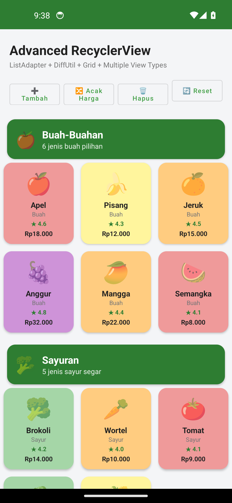
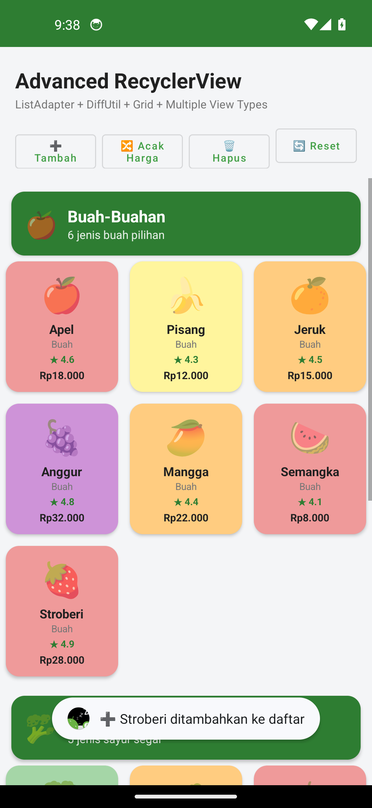
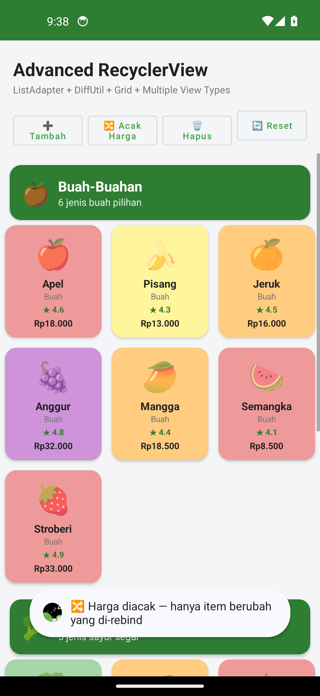
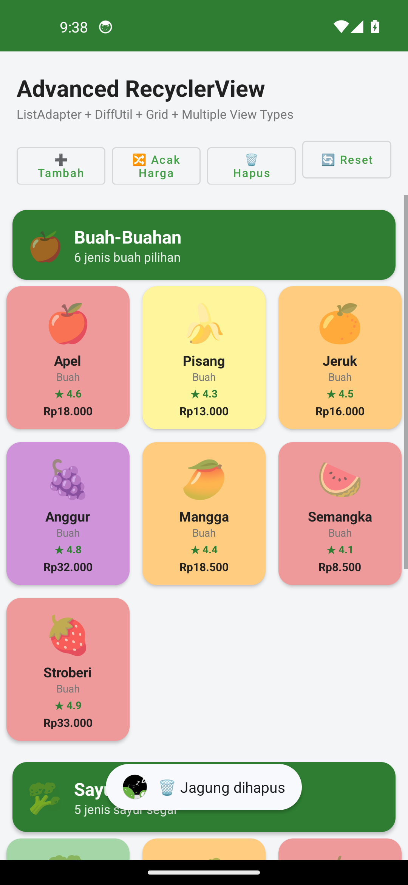
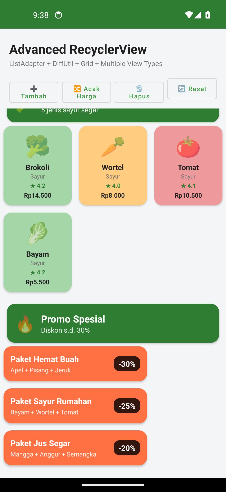
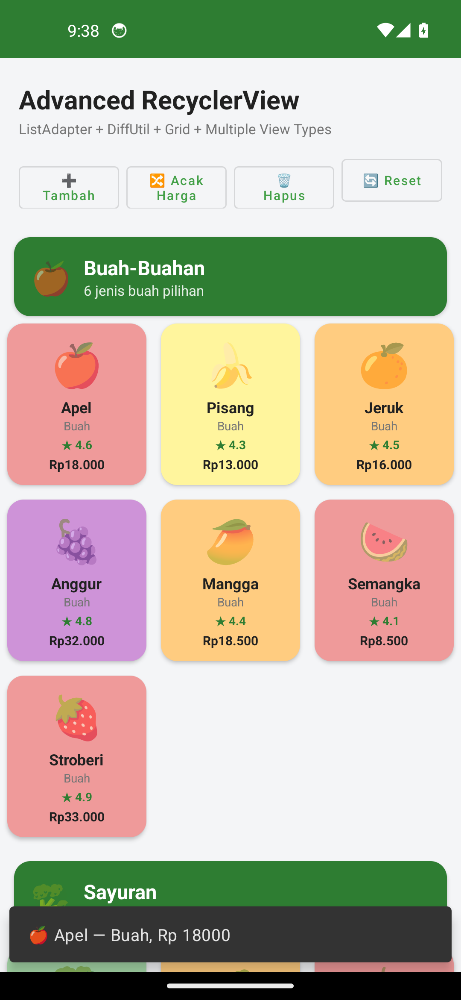
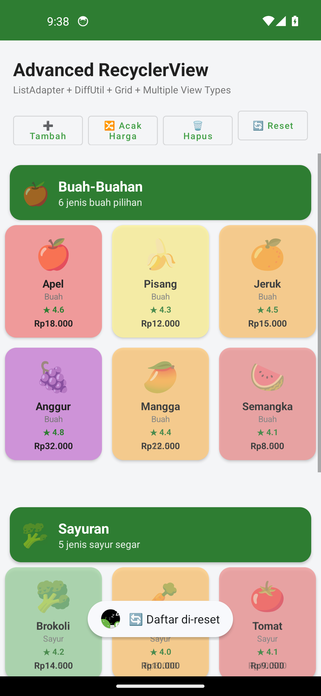
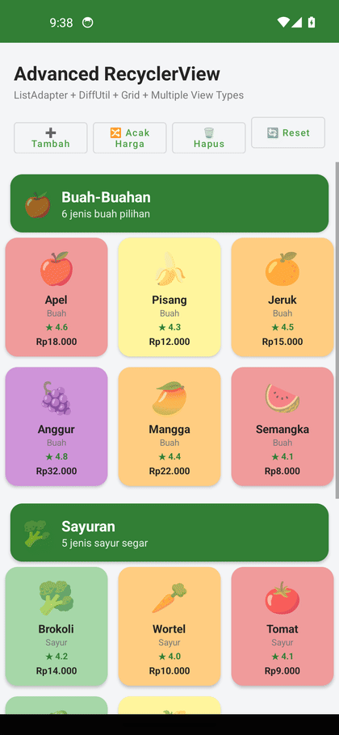

# Tugas 10 — Advanced RecyclerView: ListAdapter + DiffUtil, Multiple View Types & Grid Asimetris

**Aplikasi:** Katalog Buah & Sayur Segar 🍎🥦
**Mata Kuliah:** Pemrograman Perangkat Bergerak (Android)
**Nama:** Sadam Husen
**NIM:** 452024611109
**Kelas:** TI5A2
**Universitas:** UNIDA Gontor
**Repo:** `Tugas10_Android_AdvancedRV_452024611109`

---

## Ringkasan

Aplikasi ini adalah studi implementasi **Advanced RecyclerView** pada Android. Aplikasi menampilkan
katalog buah & sayur dalam **grid 3 kolom asimetris** dengan **3 jenis view (multiple view types)** —
*Header*, *Item Buah/Sayur*, dan *Promo* — yang diatur oleh `GridLayoutManager` + `SpanSizeLookup`.
Seluruh pembaruan data (tambah item, acak harga, hapus item, reset) berjalan lewat
**`ListAdapter.submitList()`** sehingga **DiffUtil** menghitung perubahan minimal dan RecyclerView
hanya me-rebind item yang benar-benar berubah — tanpa satu pun panggilan `notifyDataSetChanged()`.

### Kriteria yang dipenuhi

| Kriteria | Implementasi |
|---|---|
| ListAdapter + DiffUtil | `FruitListAdapter : ListAdapter<ListItem, RecyclerView.ViewHolder>` dengan `DiffUtil.ItemCallback`. `areItemsTheSame` membandingkan **id unik**; `areContentsTheSame` membandingkan **isi objek** (bukan data mentah). Diff dijalankan **background thread** (AsyncListDiffer bawaan `submitList`). |
| Multiple View Types + Grid | 3 view type (`TYPE_HEADER`, `TYPE_PROMO`, `TYPE_FRUIT`) via override `getItemViewType()`; grid 3 kolom asimetris: Header = 3 span (satu baris penuh), Promo = 2 span, Item = 1 span — lewat `SpanSizeLookup`. |
| ViewHolder + BindingAdapter | Konstruktor ViewHolder **private** dengan **factory di companion object**; 3 `@BindingAdapter` kustom (`app:cardTint`, `app:priceFormat`, `app:ratingText`) dipanggil langsung dari XML layout item. |
| README + Rekaman | Screenshot grid, perbedaan tampilan antar view type, GIF demo kelancaran pembaruan, dan analisis efisiensi (bagian bawah). |

---

## Fitur Aplikasi

1. **Tampilkan katalog** — grid 3 kolom: header kategori (3 span), item buah/sayur (1 span, kartu
   berwarna sesuai jenisnya), dan kartu promo diskon (2 span).
2. **➕ Tambah** — menyisipkan item baru (Stroberi 🍓, Kiwi 🥝, dst.) di posisi acak; DiffUtil
   menganimasikan *insert* tanpa rebind seluruh daftar.
3. **🔀 Acak Harga** — mengubah harga ~60% item secara acak; DiffUtil hanya me-rebind item yang
   harganya benar-benar berubah (*change*), sisanya tidak tersentuh.
4. **🗑 Hapus** — menghapus satu item acak; DiffUtil menganimasikan *remove*.
5. **🔄 Reset** — mengembalikan daftar ke kondisi awal.
6. **Tap item** — menampilkan Snackbar berisi detail item (nama, kategori, harga).

## Screenshot

Grid awal (header 3-span + 3 kolom item) | Setelah ➕ Tambah (toast "Stroberi ditambahkan")
:---:|:---:
 | 

Setelah 🔀 Acak Harga (harga berubah, struktur tetap) | Setelah 🗑 Hapus (satu item dihilangkan)
:---:|:---:
 | 

Promo 2 span (lebar ⅔ baris) | Snackbar detail item saat tap
:---:|:---:
 | 

Reset daftar | GIF demo kelancaran pembaruan (ListAdapter + DiffUtil)
:---:|:---:
 | 

> GIF direkam dari emulator Android 14 (API 34) saat demo dijalankan: Tambah → Acak → Hapus →
> scroll ke Promo → tap item (Snackbar) → Reset. Terlihat pembaruan daftar **mulus tanpa
> kedipan/rebind seluruh layar**, ciri khas ListAdapter + DiffUtil.

---

## Struktur Kode

```
app/src/main/java/com/example/android/advancedrv/
├── MainActivity.kt            # GridLayoutManager + SpanSizeLookup, tombol demo, Snackbar
├── model/
│   └── ListData.kt            # sealed class ListItem: Header / FruitItem / PromoItem
├── data/
│   └── FruitCatalog.kt        # dataset katalog + mutasi (tambah/acak/hapus)
├── binding/
│   └── BindingAdapters.kt     # 3 @BindingAdapter kustom (cardTint, priceFormat, ratingText)
└── list/
    └── FruitListAdapter.kt    # ListAdapter + DiffUtil.ItemCallback + 3 ViewHolder (factory)
```

Layout (`res/layout/`): `activity_main.xml`, `item_header.xml` (3 span), `item_fruit.xml` (1 span,
memakai binding adapter), `item_promo.xml` (2 span).

---

## Analisis Efisiensi: `ListAdapter` vs `RecyclerView.Adapter` biasa

### `RecyclerView.Adapter` standar (`notifyDataSetChanged()`)

| Aksi | Jumlah tindakan RecyclerView |
|---|---|
| Ubah **1** harga dari 20 item | `notifyDataSetChanged()` → **semua 20 view holder** dibuang & dibuat ulang + **semua item di-relayout**, walau hanya 1 yang berubah |
| Tambah 1 item | Sama: 21 item semuanya di-bind ulang dari nol |
| Aksi beruntun (10× acak harga) | Setiap aksi = rebind **penuh**; skala kerja O(N) per aksi |

Konsekuensi: layar **berkedip** (item kehilangan state scroll), animasi tidak ada, pemborosan CPU/GPU,
dan pada daftar panjang terasa lag — apalagi bila item berat (gambar, bitmap, binding kompleks).

### `ListAdapter` + `DiffUtil` (dipakai di aplikasi ini)

| Aksi | Yang terjadi di balik layar |
|---|---|
| Ubah **1** harga dari 20 item | `submitList()` → diff di **background thread** (AsyncListDiffer) menemukan **1 change** → RecyclerView me-rebind **1 holder** saja + menganimasikan perubahan. 19 holder lainnya **tidak tersentuh** |
| Tambah 1 item | Diff menemukan **1 insert** (+ pergeseran posisi yang dibutuhkan) → hanya holder baru yang di-bind; sisanya tetap |
| Hapus 1 item | Diff menemukan **1 remove** → animasi remove, tanpa rebind massal |
| Aksi beruntun | Setiap aksi O(changes) kecil; holder di luar perubahan **tidak pernah di-bind ulang** |

### Perbandingan angka (contoh konkret daftar 20 item)

| Skenario | `RecyclerView.Adapter` + `notifyDataSetChanged` | `ListAdapter` + `DiffUtil` |
|---|---|---|
| Acak harga 12 item (60%) | 20 bind + 20 relayout | **12 bind** (hanya item berubah) |
| Tambah 1 item | 21 bind + 21 relayout | **1 bind** (insert) |
| Hapus 1 item | 20 bind + 20 relayout | **0 bind** (item tinggal di-recycle, animasi remove) |
| Biaya komputasi | Di UI thread, O(N) per aksi | Diff di **background thread**, O(N log N) sekali, UI tetap 60 fps |

**Kesimpulan:** `ListAdapter` unggul karena (1) *payload perubahan minimal* — jumlah bind sebanding
dengan jumlah item yang benar-benar berubah, bukan ukuran daftar; (2) *diff tidak memblokir UI
thread*; (3) *animasi bawaan* (insert/remove/move/change) yang membuat interaksi terasa hidup.
Syaratnya: model wajib `equals`/`hashCode` yang benar (diimplementasi lewat data class) dan id
stabil — itulah mengapa `areItemsTheSame` memakai **id unik** (`id` di `ListItem`) dan
`areContentsTheSame` membandingkan **isi objek**, bukan referensi/data mentah.

---

## Cara Menjalankan

```bash
# Build debug
./gradlew assembleDebug

# Install ke emulator/perangkat
adb install app/build/outputs/apk/debug/app-debug.apk
```

Min SDK 21 (Android 5.0), Target SDK 34 (Android 14). Dependency: RecyclerView 1.3.2,
Material Components 1.12.0, Data Binding + View Binding aktif.

## Catatan Verifikasi

Demo interaktif diverifikasi lewat *instrumented test* (`androidTest/DemoDriverTest.kt`) yang
menjalankan seluruh urutan aksi (Tambah → Acak → Hapus → scroll → tap → Reset) dan merekam
screenshot tiap langkah — bukti kelancaran pembaruan list sesuai rekaman GIF di atas.

---
© 2026 Sadam Husen — Tugas Mata Kuliah Pemrograman Perangkat Bergerak, UNIDA Gontor.
